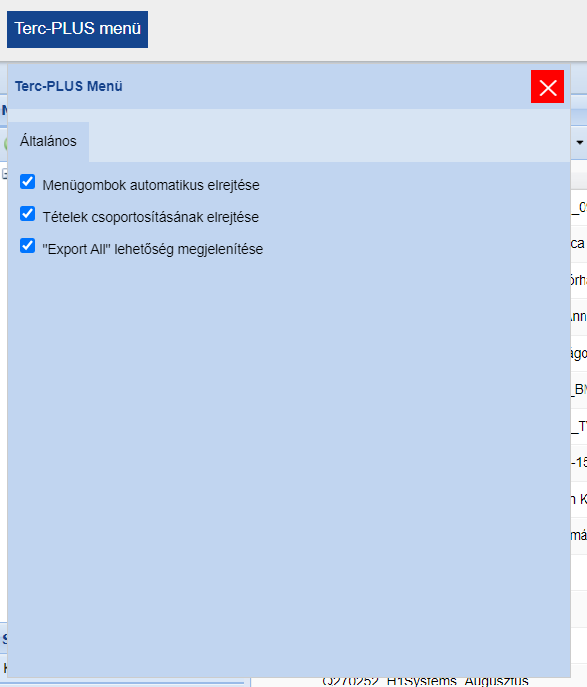
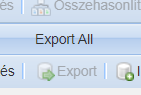
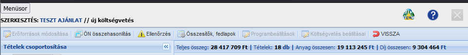
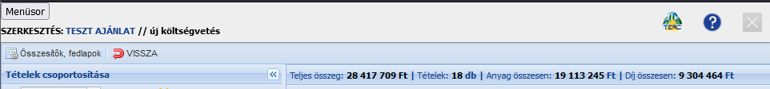

# Terc-PLUS
Terc felhasználói felület javítása

**!! Tapasztalatlan programozó fércmunkája, az esetleges hibákért felelősséget nem tudok vállalni !!**

 

# Funkciók

1. Az *"Összes munkanem"* szöveg helyén az ajánlat teljes ára található, amit az *"Anyag összesen"* és *"Díj összesen"* számok összeadásából számol ki
1. A *"SZERKESZTÉS:{adott projekt címe}"* felkerül a fejlécbe
1. Az előbbi érdekében mind a Terc-etalon logó, mind a középső terc.hu-ra mutató hivatkozás, mind az email elrejtésre került
1. A cím helyére bekerültek azok a vezérlőgombok, melyek ettől jobbra helyezkednek el
1. Egy bal felső sarokban található gombbal elrejthető/megjeleníthető az *"Összesítők fedlapok"* és a *"Visszalépés"* gombokon kívüli vezérlőelemek (alapból elrejtve)
1. *"Tételek csoportosítása"* ablak automatikus becsukása
1. Tömeges export: *"Export All"* gomb megnyomása után minden kijelölt elemet exportál (folyamatos beállításon)
1. Lebegő menü, minek segítségével az egyes funkciókat ki/be lehet kapcsolni

 

# Telepítés

A szkript a legtöbb modern böngészőre telepíthető. 

1. Telepítsd a **Violentmonkey** kiegészítőt az alábbi oldalak egyikéről:
    * [Mozilla Firefox](https://addons.mozilla.org/en-US/firefox/addon/violentmonkey/)
    * [Google Chrome](https://chromewebstore.google.com/detail/jinjaccalgkegednnccohejagnlnfdag?hl=hu&utm_source=ext_sidebar)
    * [Új Microsoft Edge](https://microsoftedge.microsoft.com/addons/detail/violentmonkey/eeagobfjdenkkddmbclomhiblgggliao)
1. Most már telepítheted a Terc-PLUS szkriptet. Ehhez [kattints ide](https://github.com/MentalGravis/Terc-PLUS/releases/latest/download/Terc.PLUS.user.js).
1. A megjelenő oldalon kattints az **Install** gombra.
1. Lépj be a Terc-etalon-ba, és használd egészséggel.

 

# Képek

**TERC Plus menü** 
<picture>
 
</picture>
**Export All gomb** 
<picture>
 
</picture>
**Minden menügombbal** 
<picture>
 
</picture>
Csak az **Összesítők fedlapok** és a **Vissza** gombokkal 
<picture>

</picture>

 

# Jelenleg ismert hibák

Ha új hibát észlelsz, vagy új funkció beépítésére szeretnél ajánlatot tenni, [itt megteheted](https://github.com/MentalGravis/Terc-PLUS/issues)

- [x] [~~Néha a menüsor gombaji furcsán jelennek meg, és a fejlécbe lógnak~~](https://github.com/MentalGravis/Terc-PLUS/issues/2)
- [x] [~~Néha több ajánlat megnyitása utána a címsor helye üresen megmarad, ami a fejléc szétcsúszásához vezet~~](https://github.com/MentalGravis/Terc-PLUS/issues/3)
- [x] [~~(Opcionális) Ajánlat teljes árának pénzneme fekete, míg a sorban a többi mértékegység kék~~](https://github.com/MentalGravis/Terc-PLUS/issues/4)
- [x] [~~Nem látszik a teljes összeg!~~](https://github.com/MentalGravis/Terc-PLUS/issues/17)

 

# Lehetséges új funkciók

1. [Saját memóriába mentett TERC email kontaktok](https://github.com/MentalGravis/Terc-PLUS/issues/5), melyeket mind küldésnél, mind fogadásnál naplóz, majd küldésnél egy legördülő listából lehet válogatni
    * A fentebb említett menübe integrálás, oly módon, hogy beceneveket lehessen adott email-hez beállítani
    * Monkey saját memóriájának használata, Kulcs - Érték párok
1. [Beírható szorzó és alapösszeg, ami alapján meghatározza a célösszeget, illetve a teljes összeg aktuálisan ettől való eltérését](https://github.com/MentalGravis/Terc-PLUS/issues/9)
    * Lebegő menü
        * Melyet gombbal lehet megjeleníteni, elrejteni
        * Benne pipával lehet engedélyezni, illetve nem engedélyezni, ami alapján eltünteti a célösszeget és az eltérést
    * Lehetőség nem csak szorzóra, de eredményszámításra is
1. [Segédszámítások tételekhez ablak](https://github.com/MentalGravis/Terc-PLUS/issues/11)
    * egy sor, mely a megadott alapösszeg, a beírt rezsióradíj, munkaidő és szorzó alapján kiszámolja az anyagköltséget
        * lehetőség műveletekre (szorzás, osztás, összeadás, kivonás) az alapösszeg cellában, ennek végösszege zárójelben jelenjen meg a cella alatt/mellett
            * gyakran a darabár és a munkadíj újraosztásra kerül
            * gyakran több tétel összevonásra kerül
            * gyakran sok tétel egyesült ára jelenik meg, melyet érdemes szétosztani
1. ["Fontos" label költségvetésre, ami alapján mindig első helyen jelenik meg](https://github.com/MentalGravis/Terc-PLUS/issues/12)
1. [Saját adattár nem K tételét megpróbálja megtalálni öntételben](https://github.com/MentalGravis/Terc-PLUS/issues/13)
1. [Új költségvetés létrehozásánál default értékek automatikus kitöltése](https://github.com/MentalGravis/Terc-PLUS/issues/18)
    * default értékek menüben állíthatóak be